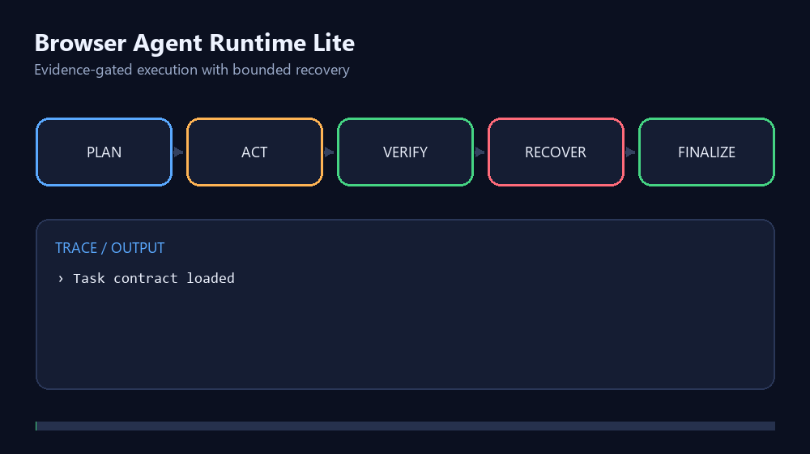

# Browser Agent Runtime Lite

[](https://github.com/wkaixuan677-arch/browser-agent-runtime-lite/actions/workflows/ci.yml)
[](https://github.com/wkaixuan677-arch/browser-agent-runtime-lite/releases)
[](LICENSE)

**一个以证据为准入条件、遵循 `规划 → 执行 → 验证 → 恢复` 闭环的 Browser Agent 最小运行时。项目提供可重复的本地 Playwright 演示。**

Agent 进程停止，并不等于用户目标已经完成。本项目要求 Agent 必须取得可观察的网页证据，才能宣布任务完成；遇到失败时，只允许在明确预算内进行恢复，避免无休止循环。

> 本项目是独立完成的 clean-room 公开实现，不包含任何公司代码、内部提示词、私有轨迹、账号凭据或生产数据，也不代表任何公司的内部落地成果。



查看：[完整架构说明](docs/ARCHITECTURE.md) · [中文面试讲解材料](docs/INTERVIEW_GUIDE.md)

作品集导航：**Browser Runtime** · [Agent Eval Lab](https://github.com/wkaixuan677-arch/agent-eval-lab) · [Research Agent](https://github.com/wkaixuan677-arch/open-source-research-agent)

## 项目解决什么问题

- **任务契约（Task Contract）**：固定任务目标、成功条件、允许访问的来源及执行预算。
- **结构化规划（Planning）**：每一步都有明确目标和验收条件。
- **语义工具调用（Tool Calling）**：通过元素角色和可访问名称操作网页，不只依赖易失效的坐标。
- **目标验证（Verification）**：缺少 URL 或页面文本证据时，拒绝 Agent 提前结束。
- **有限恢复（Bounded Recovery）**：记录失败动作，避免在同一状态下反复执行同一错误操作。
- **经验记忆门控（Memory Gating）**：只有达到 `promoted` 状态的经验才会检索并注入 Policy 上下文。
- **可观测轨迹（Trajectory）**：保存经过脱敏、顺序明确的规划、动作、验证与恢复事件。
- **确定性演示**：覆盖正常成功、失败后恢复成功、遇到明确阻断三类场景。

```text
任务契约
   ↓
  规划
   ↓
  执行 ──工具失败──→ 恢复 ──有限重试──┐
   ↓                                  │
  验证 ──证据不足──────────────────────┘
   ↓
 最终回答
```

## 快速运行

环境要求：Node.js 22 或更高版本。

```bash
npm install
npx playwright install chromium
npm run demo
```

预期输出：

```text
happy-path: COMPLETED | steps=1 recoveries=0
bounded-recovery: COMPLETED | steps=2 recoveries=1
explicit-blocked: BLOCKED | steps=0 recoveries=0
```

运行不需要 API Key。浏览器只访问由 `127.0.0.1` 提供的临时测试页面，不访问真实网站，也不调用外部模型。

本地开发还可以通过 `AGENT_BROWSER_CHANNEL=msedge` 或 `AGENT_BROWSER_CHANNEL=chrome` 复用已安装的浏览器；CI 会安装固定版本的 Playwright Chromium。

## 为什么它属于 Agent Runtime

策略模块负责提出动作，但无权自行判定成功。`BrowserAgentRuntime` 会把每次结果交给 `verifyGoal`：

1. 动作执行后收集页面状态和证据；
2. 验证器检查任务成功条件；
3. 没有证据的 `finish` 会被拒绝，并消耗恢复预算；
4. 工具失败会生成动作指纹，禁止无限重复同一失败操作；
5. 只有验证通过后，运行时才能进入最终完成状态。

核心接口由 [`src/index.ts`](src/index.ts) 导出：

- `TaskContract`：任务目标、约束及预算；
- `AgentPolicy`：动作决策策略；
- `BrowserAction`：结构化浏览器动作；
- `VerificationReport`：目标验证结果；
- `ExperienceMemory`：带生命周期的经验记忆；
- `RunResult`：任务结果与证据轨迹。

默认演示使用 `ScriptedPolicy`，让所有行为都可重复、可检查，不依赖隐藏的 API 调用。Provider-neutral LLM Adapter 是后续扩展方向。

## 自动测试

```bash
npm run check
```

测试覆盖：证据门控完成、首屏已满足目标、语义目标恢复、假完成拒绝、动作后阻断、Memory 注入和跨域请求预拦截。GitHub Actions 会自动执行类型检查、全部测试和本地浏览器演示。

## 安全边界

- 只允许访问任务契约明确列出的来源，跨域导航会在网络请求发出前拦截；
- 每次执行使用全新的临时浏览器上下文；
- 测试页面不接收账号或个人数据；
- 不绕过验证码、登录墙或访问控制；
- 步数、恢复次数和浏览器动作均有上限；运行总时限在循环边界检查，尚未实现对任意 Policy 调用的强制取消；
- 输出轨迹会移除本地绝对路径等环境信息。

漏洞反馈方式见 [SECURITY.md](SECURITY.md)。

## 当前限制

- 这是用于展示核心机制的最小运行时，不是生产级浏览器自动化服务；
- 当前内置策略是确定性的，不能代表真实 LLM 的能力；
- 验证器目前主要支持 URL 和可见文本证据；
- Memory 示例验证的是生命周期门控，而非语义检索效果；
- 本仓库不宣称已经验证真实网页泛化、多模型泛化或公司内部落地。

## 后续计划

- 增加模型无关的 LLM Adapter 和结构化输出约束；
- 增加全链路 AbortSignal、截图证据及更严格的动作结果验证；
- 输出 JSONL 轨迹和轻量评测报告；
- 增加无需登录、可重复运行的真实网页任务。

## 开源协议与贡献

项目采用 [MIT License](LICENSE)。提交贡献前请阅读 [CONTRIBUTING.md](CONTRIBUTING.md)。
