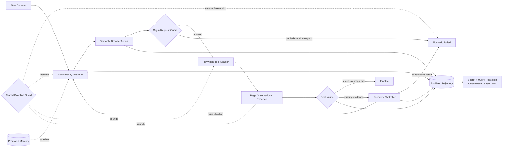
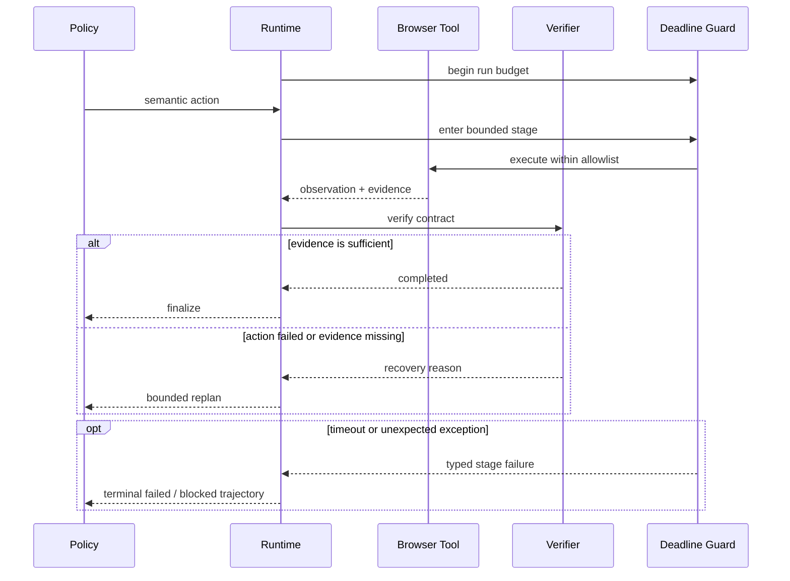

# 架构说明

## 核心边界

- Policy 只能提出动作，不能自行宣布任务成功；
- Verifier 根据 Task Contract 与可观察证据决定是否完成；
- Recovery Controller 统一限制步数、失败动作重复和恢复次数；
- Deadline Guard 从运行开始就约束 `open`、`observe`、`createPlan`、`policy.nextAction` 和 `tool`，阶段超时或异常均写入终止轨迹；
- 只有 `promoted` Memory 可以被检索并注入 Policy 上下文，候选经验不会直接影响执行；
- Origin Request Guard 在 Playwright 可路由的导航请求发出前执行 allowlist 校验；Runtime 还会对每次 Observation 按 Task Contract 复核来源，越界证据绝不能完成任务；
- Trajectory 只保存脱敏后的规划、动作、证据与恢复事件；输入文本、常见凭据、邮箱、URL 查询参数和本地路径会被移除，观察文本最多保留 2,000 字符。

Deadline Guard 使用统一的 Promise 截止时间停止运行时等待。超时后会调用 Tool Adapter 的可选 `cancel`，并把 Runtime 标记为不可复用，避免迟到结果污染下一次任务；第三方 Policy / Tool 若要撤销外部副作用，仍需自行支持 `AbortSignal`。

Origin Request Guard 使用 BrowserContext 路由覆盖普通导航、popup 首请求和重定向检查，但它不是进程级网络沙箱。强安全模式必须使用独立 BrowserContext 并配置 `serviceWorkers: 'block'`。

## 一次运行的关键时序

