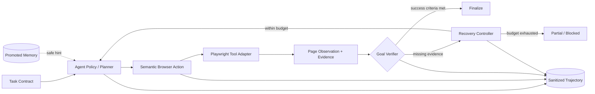
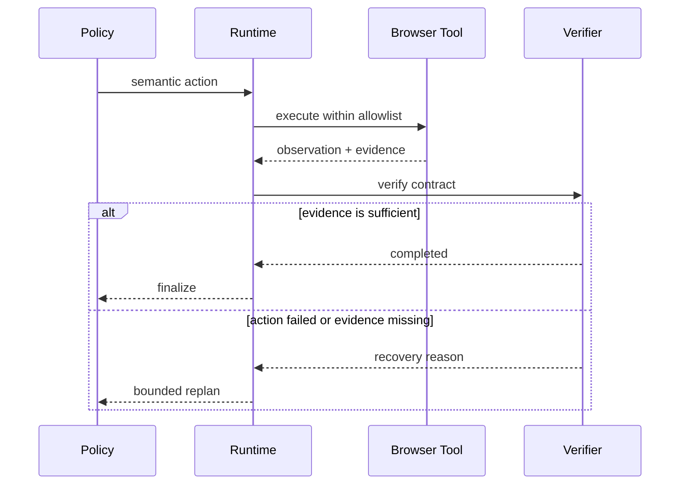

# 架构说明

## 核心边界

- Policy 只能提出动作，不能自行宣布任务成功；
- Verifier 根据 Task Contract 与可观察证据决定是否完成；
- Recovery Controller 统一限制步数、失败动作重复和恢复次数；
- 只有 `promoted` Memory 可以自动注入，候选经验不会直接影响执行；
- Trajectory 只保存脱敏后的规划、动作、证据与恢复事件。

## 一次运行的关键时序

